# devsecops-pipeline

Production-inspired DevSecOps platform demonstrating secure, traceable software delivery with CI/CD security gates, code quality enforcement, container hardening, vulnerability scanning, Terraform validation, artifact promotion design, and evidence-driven release governance.

Built by **Olatubosun Enoch David** as a flagship DevSecOps portfolio project.

## Project overview

`devsecops-pipeline` shows how modern engineering teams shift security left and keep release decisions auditable.

The platform is built around one central idea: every important delivery decision should produce evidence. A recruiter or hiring manager should be able to inspect the repository and see how code quality, secrets, dependencies, containers, infrastructure, and approvals are controlled before production release.

## What this project demonstrates

- Secure CI/CD design
- GitHub Actions PR validation
- Jenkins trusted release orchestration
- Java/Spring Boot sample workload
- Docker image hardening
- SonarQube quality gate
- Gitleaks secret scanning
- Semgrep SAST
- OWASP Dependency-Check
- Trivy image and IaC scanning
- Terraform validation
- Amazon ECR image promotion
- Digest-based release approval
- Production-style documentation and evidence

## Architecture diagram

```mermaid
flowchart LR
    Dev[Developer] --> GitHub[GitHub Repository]
    GitHub --> GHA[GitHub Actions PR Validation]
    GHA --> Jenkins[Jenkins Trusted Release Pipeline]
    Jenkins --> Tests[Build and Unit Tests]
    Tests --> Sonar[SonarQube Quality Gate]
    Sonar --> Secrets[Gitleaks Secret Scan]
    Secrets --> SAST[Semgrep SAST]
    SAST --> Deps[OWASP Dependency-Check]
    Deps --> IaC[Terraform Validate + Trivy IaC]
    IaC --> Docker[Hardened Docker Build]
    Docker --> Trivy[Trivy Image Scan]
    Trivy --> ECR[Amazon ECR Digest Promotion]
    ECR --> Approval[Manual Production Approval]
    Approval --> Deploy[Deployment Readiness]
```



The detailed architecture, trust boundaries, and decision records live in [`architecture`](architecture).

## Technologies used and why

| Technology | Why it is used |
| --- | --- |
| AWS / Amazon ECR | Represents the production cloud artifact registry and immutable image promotion target. |
| GitHub | Source control, collaboration boundary, and pull request review surface. |
| GitHub Actions | Fast pre-merge validation without exposing production credentials. |
| Jenkins | Trusted release orchestration, manual approvals, credential boundaries, and archived release evidence. |
| Docker | Reproducible application packaging and runtime hardening. |
| SonarQube | Quality gate for reliability, maintainability, coverage, and code health. |
| Trivy | Container image vulnerability scanning and Terraform/IaC misconfiguration scanning. |
| Semgrep | Static application security testing for source-level insecure patterns. |
| Gitleaks | Secret detection across repository content and history. |
| OWASP Dependency-Check | Known vulnerability analysis for Java dependencies. |
| Terraform | Infrastructure-as-code validation and future AWS runtime foundation. |
| Ubuntu/Linux | Production-like execution environment for containers and CI agents. |

## Delivery flow

```text
Developer
  -> GitHub
  -> GitHub Actions PR validation
  -> Jenkins trusted release pipeline
  -> Build and unit tests
  -> SonarQube quality gate
  -> Gitleaks secret scanning
  -> Semgrep SAST
  -> OWASP Dependency-Check
  -> Terraform validation and IaC scan
  -> Docker build
  -> Trivy image scan
  -> Amazon ECR push
  -> Digest capture
  -> Manual production approval
  -> Deployment readiness
```

## Current status

The project includes the core secure delivery platform, scanner configuration, release pipeline design, local validation scripts, and evidence documentation.

Runtime deployment is intentionally deferred until ECS infrastructure is added. The pipeline already promotes a verified image to ECR and records the digest that future deployment should consume.

## Repository structure

```text
devsecops-pipeline/
  .github/workflows/        GitHub Actions PR validation
  app/                      Spring Boot sample service
  architecture/             Architecture, threat model, ADRs
  docker/                   Hardened application Dockerfile
  docs/                     Deployment, security, operations, and project docs
  jenkins/                  Jenkins release pipeline documentation
  scripts/                  Local verification and scanner helpers
  security/                 Scanner config and security policies
  terraform/                Terraform validation and environment structure
```

## Quick local checks

```powershell
powershell -NoProfile -ExecutionPolicy Bypass -File .\scripts\verify-app.ps1
powershell -NoProfile -ExecutionPolicy Bypass -File .\scripts\build-app-image.ps1 -RuntimeImage maven:3.9.16-eclipse-temurin-21 -ImageTag offline-test
powershell -NoProfile -ExecutionPolicy Bypass -File .\scripts\verify-app-container.ps1 -Image secure-delivery-api:offline-test
powershell -NoProfile -ExecutionPolicy Bypass -File .\scripts\run-semgrep.ps1
powershell -NoProfile -ExecutionPolicy Bypass -File .\scripts\validate-terraform.ps1
powershell -NoProfile -ExecutionPolicy Bypass -File .\scripts\run-iac-scan.ps1
```

Some scanners require network access to vulnerability databases. See the troubleshooting guide if first runs are slow.

## Local development guide

For local validation, use Docker Desktop and PowerShell from the repository root:

1. Run application tests with `scripts/verify-app.ps1`.
2. Build the hardened image with `scripts/build-app-image.ps1`.
3. Run scanners with the scripts in `scripts/`.
4. Review generated reports locally before promoting artifacts.

The local workflow mirrors the trusted CI/CD flow without requiring production AWS credentials.

## Deployment guide

This project currently stops at deployment readiness. A verified image is built, scanned, and prepared for digest-based promotion.

Runtime deployment to AWS ECS/Fargate is intentionally deferred until the infrastructure module is added. See:

- [Deployment guide](docs/deployment/deployment-guide.md)
- [ECR promotion guide](docs/deployment/ecr-promotion-guide.md)
- [Runtime deployment contract](docs/deployment/runtime-deployment-contract.md)

## Key documentation

- [Architecture overview](architecture/system-overview.md)
- [Threat model](architecture/threat-model.md)
- [Security gate policy](security/policies/security-gates.md)
- [Jenkins release stages](jenkins/release-pipeline-stages.md)
- [Deployment guide](docs/deployment/deployment-guide.md)
- [ECR promotion guide](docs/deployment/ecr-promotion-guide.md)
- [Security guide](docs/security/security-guide.md)
- [Troubleshooting guide](docs/operations/troubleshooting-guide.md)
- [Evidence guide](docs/project/evidence-guide.md)
- [Lessons learned](docs/project/lessons-learned.md)

## CI/CD pipeline

The delivery flow intentionally separates fast pull request checks from trusted release orchestration:

- GitHub Actions validates pull requests quickly and does not receive production credentials.
- Jenkins is responsible for trusted release jobs, scanner evidence, ECR push, manual approval, and digest-based promotion.
- Security gates fail closed when required tools or vulnerability databases are unavailable.

See [Jenkins release stages](jenkins/release-pipeline-stages.md) and [GitHub Actions guide](docs/operations/github-actions-guide.md).

## Infrastructure design

Terraform currently validates the environment structure and prepares the project for AWS runtime expansion.

The runtime deployment contract intentionally separates verified artifact promotion from infrastructure rollout. This is a production-style pattern: build once, scan once, promote by digest, then deploy the immutable digest.

## Monitoring and operations

The sample service exposes Spring Boot Actuator health endpoints for readiness and liveness checks. Future runtime infrastructure should connect those signals to CloudWatch, Prometheus, Grafana, and Alertmanager.

Operational documentation is available in the [troubleshooting guide](docs/operations/troubleshooting-guide.md).

## Security philosophy

This project treats security as evidence-driven delivery:

- Every major release decision should produce evidence.
- Pull request jobs should not receive production credentials.
- Trusted release jobs fail closed when required controls cannot run.
- Secrets are rotated, not merely deleted.
- Artifacts are approved and deployed by digest, not mutable tags.

## Cost optimization

The project avoids always-on AWS resources by default. Expensive runtime infrastructure is intentionally deferred until deployment is needed.

Cost controls are documented in [cost optimization](docs/project/cost-optimization.md).

## Lessons learned

This project reinforces several production lessons:

- Security tools need reliable caching and network access.
- Local validation is valuable, but trusted release evidence belongs in CI/CD.
- SonarQube and vulnerability scanners can be resource-heavy on developer laptops.
- Digest-based promotion is safer than mutable tag-based deployment.
- Honest release evidence is better than polished but unverifiable claims.

See the full [lessons learned](docs/project/lessons-learned.md).

## Next improvements

- Add ECS runtime infrastructure.
- Deploy approved digest to ECS.
- Add post-deployment smoke checks.
- Add OIDC-based AWS authentication.
- Add SBOM generation and signing.
