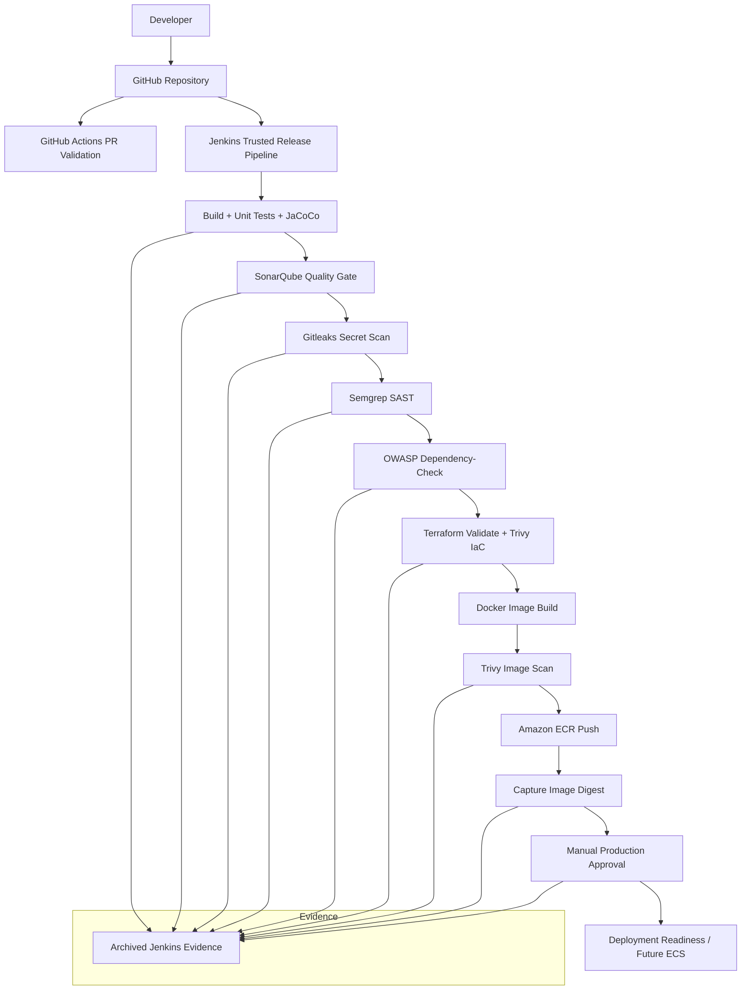

# Architecture Diagram

```mermaid
flowchart TD
    Dev[Developer] --> GitHub[GitHub Repository]
    GitHub --> GHA[GitHub Actions PR Validation]
    GitHub --> Jenkins[Jenkins Trusted Release Pipeline]

    Jenkins --> Tests[Build + Unit Tests + JaCoCo]
    Tests --> Sonar[SonarQube Quality Gate]
    Sonar --> Gitleaks[Gitleaks Secret Scan]
    Gitleaks --> Semgrep[Semgrep SAST]
    Semgrep --> DepCheck[OWASP Dependency-Check]
    DepCheck --> IaC[Terraform Validate + Trivy IaC]
    IaC --> DockerBuild[Docker Image Build]
    DockerBuild --> Trivy[Trivy Image Scan]
    Trivy --> ECR[Amazon ECR Push]
    ECR --> Digest[Capture Image Digest]
    Digest --> Approval[Manual Production Approval]
    Approval --> Deploy[Deployment Readiness / Future ECS]

    subgraph Evidence
      Reports[Archived Jenkins Evidence]
    end

    Tests --> Reports
    Sonar --> Reports
    Gitleaks --> Reports
    Semgrep --> Reports
    DepCheck --> Reports
    IaC --> Reports
    Trivy --> Reports
    Digest --> Reports
    Approval --> Reports
```
